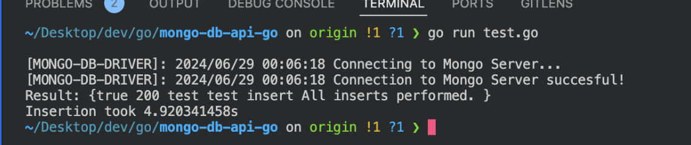
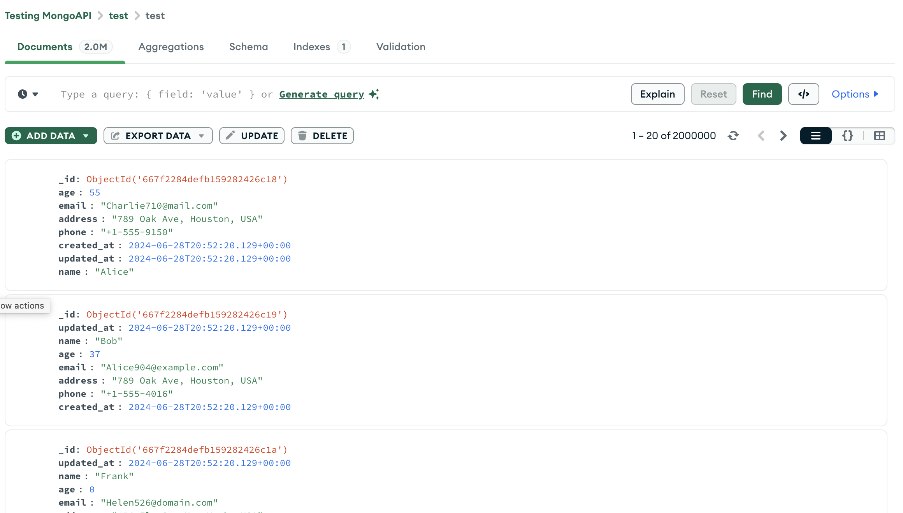

# MongoDB API

MongoDB API is a Go-Based backend that serves as a nieche method for interacting with MongoDB through an API directly or through the pre-built clients. It's quite fast. It is capable of inseting 2kkk records in under 5 seconds through the AID of goroutines and 
retrieve data even faster. The project is a WIP so treat it as such.




## Table of Contents

- [Installation](#installation)
- [Environment Variables](#environment-variables)
- [API Endpoints](#api-endpoints)
- [Pre-Built Clients](#pre-build-clients)

## Pre-build Clients
There are 2 clients available:
 - PHP 
    - https://github.com/alexanderthegreat96/mongo-api-php-client
 - Python 
    - https://github.com/alexanderthegreat96/mongo-api-python-client
 - Go (comming soon)

## Installation

1. Clone the repository:

    ```bash
    git clone https://github.com/alexanderthegreat96/mongo-db-api-go.git
    cd mongo-db-api-go
    ```

2. Install / Run / Build

    ```bash
    go mod tidy
    go run main.go
    go build main.go
    ```

3. Create a `.env` file in the root directory of your project and configure it as shown in the Environment Variables section.

4. Run the application:

    ```bash
    go run main.go
    ```

## Environment Variables

Create a `.env` file in the root directory of your project with the following variables:

```env
MONGO_DB_HOST=<your-mongo-db-host>
MONGO_DB_PORT=<your-mongo-db-port>
MONGO_DB_USERNAME=<your-mongo-db-username>
MONGO_DB_PASSWORD=<your-mongo-db-password>
MONGO_DB_NAME=<your-mongo-db-default-database>
MONGO_DB_TABLE=<your-mongo-db-default-table>
API_PORT=<api-port>
API_HOST=<api-host>
```

## API Endpoints

### List All Databases

- **URL:** `/db/databases`
- **Method:** GET
- **Success Response:**
  - Code: 200
  - Content:
    ```json
    {
      "status": true,
      "databases": ["database1", "database2", "..."]
    }
    ```
- **Error Response:**
  - Code: 500
  - Content:
    ```json
    {
      "code": 500,
      "status": false,
      "error": "Error message"
    }
    ```

### Delete a Database

- **URL:** `/db/:db_name/delete`
- **Method:** DELETE
- **URL Params:**
  - `db_name`: The name of the database to delete.
- **Success Response:**
  - Code: 200
  - Content:
    ```json
    {
      "status": true,
      "message": "Database: db_name has been deleted!"
    }
    ```
- **Error Response:**
  - Code: 400 | 500
  - Content:
    ```json
    {
      "code": 400 | 500,
      "status": false,
      "database": "db_name",
      "error": "Error message"
    }
    ```

### List All Collections in a Database

- **URL:** `/db/:db_name/tables`
- **Method:** GET
- **URL Params:**
  - `db_name`: The name of the database.
- **Success Response:**
  - Code: 200
  - Content:
    ```json
    {
      "status": true,
      "tables": ["collection1", "collection2", "..."]
    }
    ```
- **Error Response:**
  - Code: 400 | 500
  - Content:
    ```json
    {
      "code": 400 | 500,
      "status": false,
      "database": "db_name",
      "error": "Error message"
    }
    ```

### Delete a Collection in a Database

- **URL:** `/db/:db_name/:table_name/delete`
- **Method:** DELETE
- **URL Params:**
  - `db_name`: The name of the database.
  - `table_name`: The name of the collection to delete.
- **Success Response:**
  - Code: 200
  - Content:
    ```json
    {
      "status": true,
      "message": "Table / collection: table_name, dropped!"
    }
    ```
- **Error Response:**
  - Code: 400 | 500
  - Content:
    ```json
    {
      "code": 400 | 500,
      "status": false,
      "database": "db_name",
      "table": "table_name",
      "error": "Error message"
    }
    ```

### Retrieve Data from a Collection

- **URL:** `/db/:db_name/:table_name/select`
- **Method:** GET
- **URL Params:**
  - `db_name`: The name of the database.
  - `table_name`: The name of the collection.
- **Query Params:**
  - `page`: The page number (default: 1).
  - `per_page`: Number of records per page (default: 10).
  - `sort`: Sort criteria (optional).
  - `query_and`: AND query criteria (optional).
  - `query_or`: OR query criteria (optional).
- **Success Response:**
  - Code: 200
  - Content:
    ```json
    {
      "status": true,
      "code": 200,
      "database": "db_name",
      "table": "table_name",
      "count": 10,
      "pagination": {
        "total_pages": 1,
        "current_page": 1,
        "next_page": null,
        "prev_page": null,
        "last_page": 1,
        "per_page": 10
      },
      "query": {},
      "results": [...]
    }
    ```
- **Error Response:**
  - Code: 400 | 500
  - Content:
    ```json
    {
      "code": 400 | 500,
      "status": false,
      "database": "db_name",
      "table": "table_name",
      "query": {},
      "error": "Error message"
    }
    ```

### Retrieve Record by ID

```
GET /db/:db_name/:table_name/get/:mongo_id
```

### Parameters

- `db_name`: The name of the MongoDB database.
- `table_name`: The name of the MongoDB collection (table) from which to retrieve the document.
- `mongo_id`: The unique identifier (MongoDB ObjectID) of the document to retrieve.

### Response

- If the document is found, the server responds with a JSON object containing the retrieved document along with metadata.
- If the document is not found or an error occurs, an appropriate error response is returned.

#### Success Response Example

```json
{
  "Status": "success",
  "Code": 200,
  "Database": "example_db",
  "Table": "example_collection",
  "Result": {
    "_id": "6054f06c8a5e3b7d26c4e51e",
    "name": "John Doe",
    "age": 30,
    "email": "john@example.com"
    // Other document fields
  }
}
```

#### Error Response Example

```json
{
  "Code": 404,
  "Status": "error",
  "Error": "Document not found",
  "Database": "example_db",
  "Table": "example_collection"
}
```
### Insert Data into a Collection

- **URL:** `/db/:db_name/:table_name/insert`
- **Method:** POST
- **URL Params:**
  - `db_name`: The name of the database.
  - `table_name`: The name of the collection.
- **Form Params:**
  - `payload`: JSON string containing the data to insert.
- **Success Response:**
  - Code: 200
  - Content:
    ```json
    {
      "code": 200,
      "status": true,
      "database": "db_name",
      "table": "table_name",
      "operation": "insert",
      "message": "Data inserted successfully."
    }
    ```
- **Error Response:**
  - Code: 400 | 500
  - Content:
    ```json
    {
      "code": 400 | 500,
      "status": false,
      "database": "db_name",
      "table": "table_name",
      "error": "Error message"
    }
    ```

### Update Data by ID

- **URL:** `/db/:db_name/:table_name/update/:mongo_id`
- **Method:** PUT
- **URL Params:**
  - `db_name`: The name of the database.
  - `table_name`: The name of the collection.
  - `mongo_id`: The MongoDB document ID.
- **Form Params:**
  - `payload`: JSON string containing the data to update.
- **Success Response:**
  - Code: 200
  - Content:
    ```json
    {
      "code": 200,
      "status": true,
      "database": "db_name",
      "table": "table_name",
      "operation": "update",
      "message": "Data updated successfully."
    }
    ```
- **Error Response:**
  - Code: 400 | 500
  - Content:
    ```json
    {
      "code": 400 | 500,
      "status": false,
      "database": "db_name",
      "table": "table_name",
      "error": "Error message"
    }
    ```

### Update Data by Query

- **URL:** `/db/:db_name/:table_name/update-where`
- **Method:** PUT
- **URL Params:**
  - `db_name`: The name of the database.
  - `table_name`: The name of the collection.
- **Form Params:**
  - `payload`: JSON string containing the data to update.
- **Query Params:**
  - `query_and`: AND query criteria (optional).
  - `query_or`: OR query criteria (optional).

### Delete Data by ID

- **URL:** `/db/:db_name/:table_name/delete/:mongo_id`
- **Method:** DELETE
- **URL Params:**
  - `db_name`: The name of the database.
  - `table_name`: The name of the collection.
  - `mongo_id`: The MongoDB document ID.
- **Success Response:**
  - Code: 200
  - Content:
    ```json
    {
      "code": 200,
      "status": true,
      "database": "db_name",
      "table": "table_name",
      "operation": "delete",
      "message": "Data deleted successfully."
    }
    ```
- **Error Response:**
  - Code: 400 | 500
  - Content:
    ```json
    {
      "code": 400 | 500,
      "status": false,
      "database": "db_name",
      "table": "table_name",
      "error": "Error message"
    }
    ```

### Delete Data by Query

- **URL:** `/db/:db_name/:table_name/delete-where`
- **Method:** DELETE
- **URL Params:**
  - `db_name`: The name of the database.
  - `table_name`: The name of the collection.
- **Query Params:**
  - `query_and`: AND query criteria (optional).
  - `query_or`: OR query criteria (optional).
- **Success Response:**
  - Code: 200
  - Content:
    ```json
    {
      "code": 200,
      "status": true,
      "database": "db_name",
      "table": "table_name",
      "operation": "delete",
      "message": "Data deleted successfully."
    }
    ```
- **Error Response:**
  - Code: 400 | 500
  - Content:
    ```json
    {
      "code": 400 | 500,
      "status": false,
      "database": "db_name",
      "table": "table_name",
      "error": "Error message"
    }
    ```
